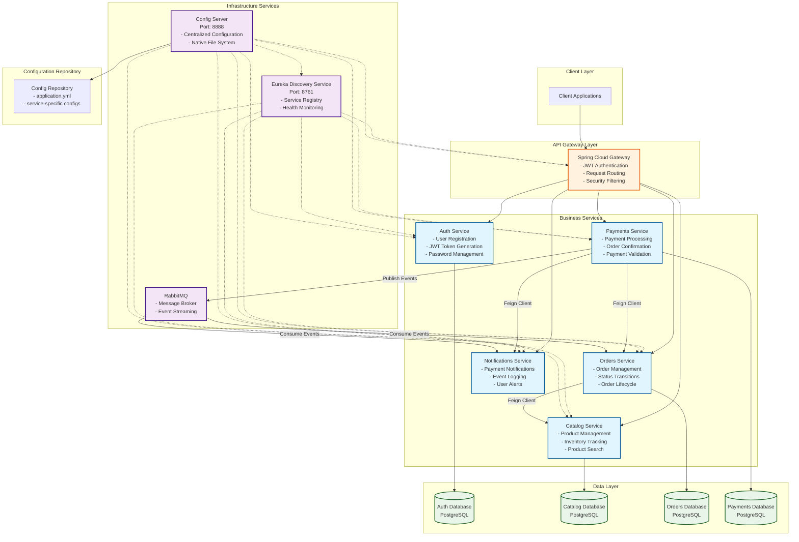

# Microservices Architecture Diagram

## Architecture Overview

The system follows a microservices architecture pattern with:
- **API Gateway** for routing and security
- **Service Discovery** for service registration and discovery
- **Configuration Management** for centralized configuration
- **Message Queue** for asynchronous communication
- **Database per Service** pattern for data isolation

## Mermaid Diagram Code

## Component Descriptions

### Infrastructure Services
- **Eureka Discovery Service**: Service registry and discovery
- **Config Server**: Centralized configuration management
- **RabbitMQ**: Message broker for asynchronous communication

### Business Services
- **Auth Service**: User authentication and JWT token management
- **Catalog Service**: Product catalog and inventory management
- **Orders Service**: Order lifecycle and status management
- **Payments Service**: Payment processing and validation
- **Notifications Service**: Event logging and user notifications

### Data Layer
- **Database per Service**: Each service has its own PostgreSQL database
- **Data Isolation**: Services don't share databases for better isolation

### Communication Patterns
- **Synchronous**: HTTP/REST APIs with Feign clients
- **Asynchronous**: Message queues for event-driven communication
- **Service Discovery**: Eureka for service registration and discovery
