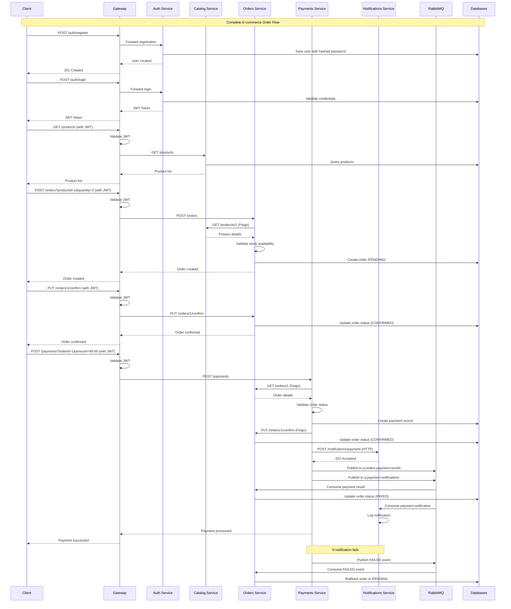

# Microservices Sequence Diagram

## Order Processing Flow

The sequence diagram demonstrates:
- **User Authentication**: Registration and login flow
- **Product Browsing**: Catalog service interaction
- **Order Management**: Order creation and confirmation
- **Payment Processing**: Payment validation and processing
- **Notification Distribution**: Multi-channel notification delivery
- **Error Handling**: Rollback mechanisms for failed operations

## Mermaid Diagram Code

## Flow Description

### 1. Authentication Phase
- User registers with username and password
- Password is hashed using BCrypt
- User logs in and receives JWT token
- JWT token is used for subsequent authenticated requests

### 2. Product Browsing Phase
- Client requests product list with JWT token
- Gateway validates JWT token
- Catalog service returns available products
- Client can search and filter products

### 3. Order Creation Phase
- Client creates order with product ID and quantity
- Orders service validates product availability via Catalog service
- Order is created in PENDING status
- Stock validation ensures sufficient inventory

### 4. Order Confirmation Phase
- Client confirms the order
- Order status changes from PENDING to CONFIRMED
- Order becomes protected from cancellation

### 5. Payment Processing Phase
- Client initiates payment with order ID and amount
- Payments service validates order status
- Payment record is created with SUCCESS status
- Order is confirmed in Orders service

### 6. Notification Distribution Phase
- Notifications are sent via HTTP to Notifications service
- Events are published to RabbitMQ queues
- Orders service consumes payment results
- Notifications service consumes payment events

### 7. Error Handling Phase
- If notifications fail, FAILED events are published
- Orders service rolls back order status to PENDING
- System maintains consistency through compensation logic

## Key Integration Points

- **Synchronous Communication**: HTTP/REST APIs with Feign clients
- **Asynchronous Communication**: RabbitMQ message queues
- **Authentication**: JWT token validation at Gateway
- **Data Consistency**: Eventual consistency with compensation logic
- **Error Recovery**: Rollback mechanisms for failed operations
